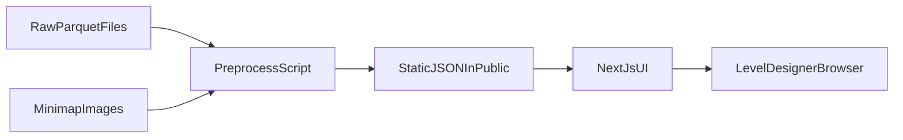

## Architecture (one page)

### Tech stack
- **Next.js (React) + TypeScript + Tailwind**: fast iteration, polished UX, and easy Vercel hosting.
- **DuckDB (Node)** for preprocessing: reliably reads parquet (even without `.parquet` extension) and handles the dataset’s binary event column.

### Data flow (parquet → browser)

1. Raw telemetry lives under `data/player_data/player_data/February_*/`.
2. `web/scripts/preprocess.mjs` uses DuckDB `read_parquet(...)` with `filename=true` to load all rows and attach the source file path.
3. The script aggregates rows into per-match JSON blobs under `web/public/data/matches/` plus an `index.json` for filtering.
4. The Next.js UI fetches `index.json`, then fetches one match blob at a time for interactive playback.

### Match reconstruction
- **Each file** = one player in one match (as described in dataset README).
- A **match** is reconstructed by grouping all rows sharing the same `match_id` and then rendering all players’ position samples + event markers together.
- **Time**: dataset timestamps are stored as timestamps but represent **elapsed time within a match**. We normalize each match’s time so the earliest row is \(t=0\) and store event/position times in **milliseconds**.

### Bots vs humans
 - `user_id` **numeric** → bot (e.g. `1440`)
 - `user_id` **UUID** → human

This is used for:
- Different path styling (humans vs bots)
- Filtering toggles in the UI

### World → minimap coordinate mapping (critical)
The dataset README defines the mapping from world \((x,z)\) to minimap pixels \((pixel_x,pixel_y)\) for 1024×1024 minimaps.

Per map we have:
- `scale`
- `origin_x`
- `origin_z`

Conversion:
- \(u = (x - origin_x) / scale\)
- \(v = (z - origin_z) / scale\)
- \(pixel_x = u * 1024\)
- \(pixel_y = (1 - v) * 1024\) (Y is flipped because image origin is top-left)

Implementation lives in `web/src/lib/maps.ts` as `worldToMinimapPixel(...)`.

### Tradeoffs / decisions
| Decision | Considered | Chosen | Why |
|---|---|---|---|
| Runtime parquet parsing in browser | parquet-wasm, arrow JS | No | Browser parsing is heavier and complicates hosting. |
| Runtime serverless parquet parsing | API routes on Vercel | No | Can be slow/fragile on free tiers; better as static artifacts. |
| Preprocessing engine | Python/pyarrow vs Node parquet libs | DuckDB (Node) | Most reliable parquet support; simplest Windows setup without Python. |
| Rendering | SVG vs Canvas | Canvas | Better performance with many points + heatmap overlays. |

### Assumptions
- Minimap images are exactly **1024×1024** as documented.
- `y` coordinate is elevation and is ignored for 2D plotting (per dataset README).
- Event strings are bytes in parquet and must be decoded; DuckDB returns BLOB which we decode to UTF‑8.

---

### Key files
- `web/scripts/preprocess.mjs`
- `web/public/data/index.json`
- `web/public/data/matches/<match_id>.json`
- `web/src/lib/maps.ts`
- `web/src/components/MinimapViewer.tsx`
